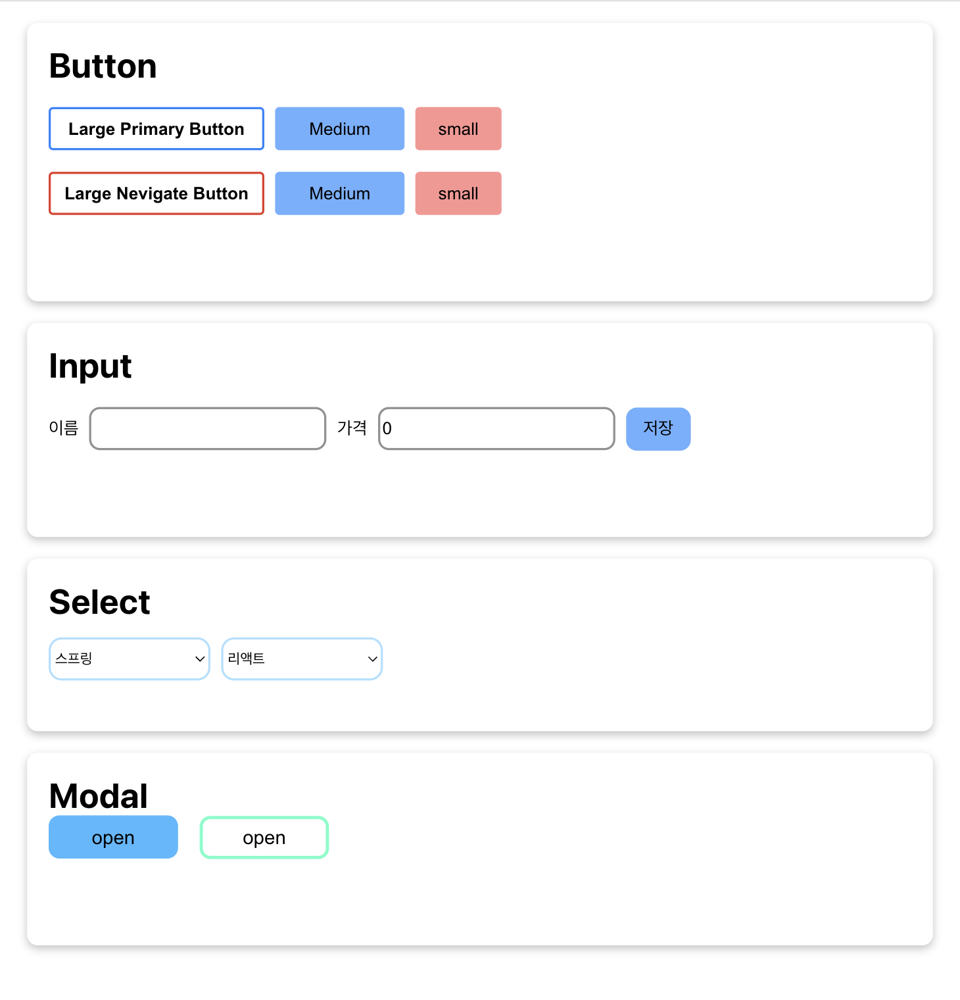

React_LV3 Assignment
```
Collection of reusable buttons
```

+ Library
  + React

+ Team member
  + [kimjonghwa230412](https://github.com/kimjonghwa230412)
  + [leolego03](https://github.com/leolego03)

#### Code Convention
```
Pascal Case: Component
Camel Case: Function, Variable

The event handler starts with an "on"
```

#### Roles
```
kimjonghwa230412: Modal, Select
leolego03: Button, Input
```

#### Design
